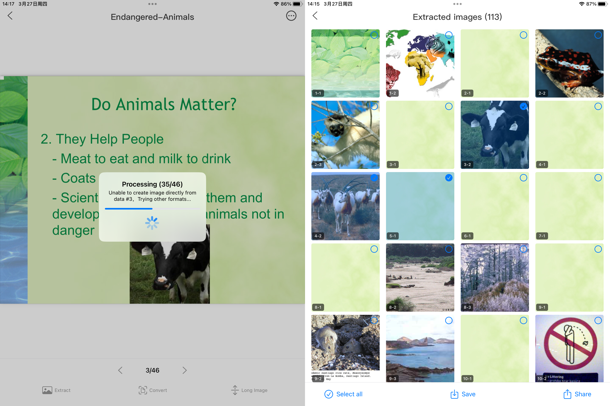

# PdfImageExtract

PDF Image Extraction - A Minimalist and Efficient PDF Image Processing Tool
Professional and Simple PDF Image Extraction Tool, Making Complex PDF Processing Easy and Intuitive!

Core Features
  Quickly Extract All Images from PDF
  One-Click Conversion of Each PDF Page to Separate Images
  Smart PDF Long Image Merging Functionality
  Support Direct PDF Import from Other Applications

Unique Advantages
 Completely Offline Operation
 Zero Network Dependency, Protecting Personal Privacy
 High-Speed Processing, Conversion Completed in Seconds
 One-Click Save to Photo Album
 Share Converted Images Anytime
 
Simple, Fast, Secure - Your PDF Image Processing Assistant!

Support or Contact

qqGroup: 820594265

Email: supportsw365@163.com

